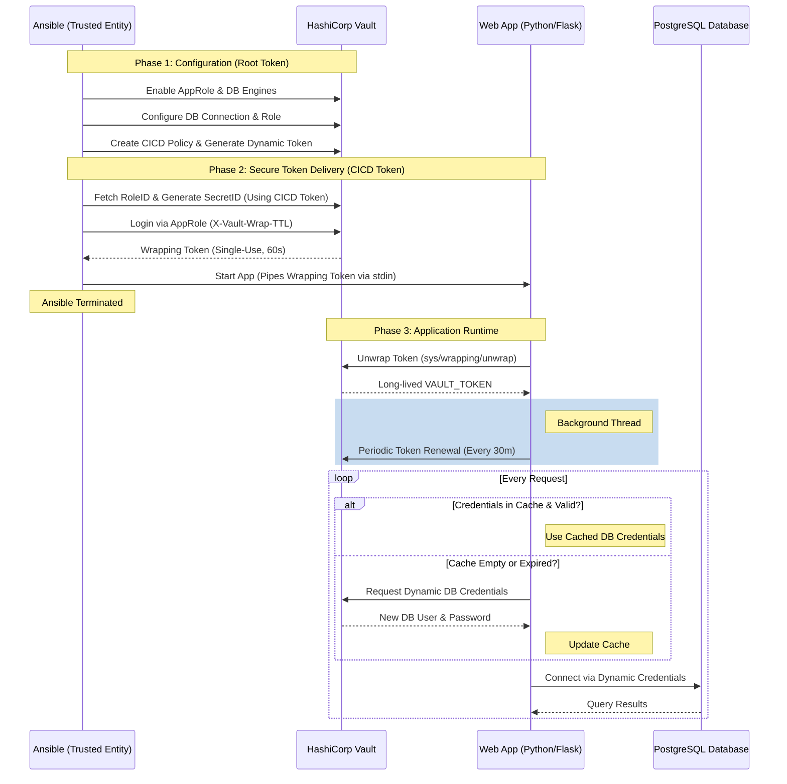

## Architecture

Below is a sequence diagram illustrating the three main phases of the demo: Vault Configuration, Credential Delivery by Ansible, and the Application Runtime flow.



> [!TIP]
> You can also find a detailed Architecture Diagram in the [architecture.drawio](architecture.drawio) file.

## Credential Mechanics: RoleID vs. SecretID

The AppRole backend is designed for machine-to-machine authentication, implementing a multi-factor approach by requiring two distinct identifiers to grant access. This follows the **Principle of Least Privilege** and ensures that a compromise of one component does not necessarily lead to a full system compromise.

| Component | Nature | Analogy | Storage / Visibility | Behavior in this Demo |
| :--- | :--- | :--- | :--- | :--- |
| **RoleID** | **Static** | Username | Application Config / Public | Assigned during role creation. It is considered a semi-public identifier. |
| **SecretID** | **Dynamic** | Password | **External / Hidden** | Generated on-demand by the "Trusted Entity". It is **single-use** with a **5m TTL**. |

### The "Zero-Knowledge" Principle
A key security feature of this implementation is that the application itself has **zero-knowledge** of its own `SecretID`. 
- **RoleID** is static and can be hardcoded in Ansible playbook.
- **SecretID** is high-privilege and dynamic. By keeping it entirely outside the application's environment (it only exists in memory within the Ansible process), we significantly reduce the blast radius if the application's environment is compromised.

### How are credentials managed and refreshed?
A critical security principle in this demo is that **the application never sees the SecretID** and cannot refresh its own credentials if they are completely lost.

Instead:
1.  **Single-Use SecretID**: In [playbook-setup-vault.yml](/ansible/playbook-setup-vault.yml), the AppRole is configured with `secret_id_num_uses: 1` and a short `5m` TTL.
2.  **Trusted Entity (Ansible)**: Ansible acts as the Trusted Entity. It:
    -   Authenticates with Vault using its own credentials.
    -   Generates a **single-use SecretID**.
    -   Performs a login to obtain a **wrapped Vault Token** (response-wrapping).
    -   Delivers this wrapped token to the application via standard input (`stdin`).
3.  **Application Responsibility**:
    -   The application reads the wrapped token from `stdin`.
    -   It **unwraps** the token to obtain the actual `VAULT_TOKEN`.
    -   Because the token is periodic, the application starts a **background thread** to renew its own token indefinitely (as long as it continues to run).

This creates a "separation of concerns" where the app only uses a short-lived delivery mechanism (the wrapped token) and then manages its own session lifecycle, while the high-privilege `SecretID` is never exposed to the application environment.

## Overview

## Prerequisites

- [Docker](https://www.docker.com/) and [Docker Compose](https://docs.docker.com/compose/)
- [Ansible](https://www.ansible.com/)
- [Python 3.9+](https://www.python.org/)
- [pip](https://pip.pypa.io/)

## Setup and Usage

### 1. Start Infrastructure
Start Vault and PostgreSQL:
```bash
docker-compose up -d
```

### 2. Configure Vault (via Ansible)
Run the setup playbook to configure the AppRole and the Database Secret Engine. You can run this from the root:
```bash
ansible-playbook -i ansible/inventory ansible/playbook-setup-vault.yml
```

### 3. Fetch Credentials and Run App (via Ansible)
Run the credentials playbook. It will fetch the `RoleID`, generate a `SecretID`, perform the login, and automatically start the Python application by piping the `VAULT_TOKEN` into its `stdin`:
```bash
ansible-playbook -i ansible/inventory ansible/playbook-start-app.yml
```

The app will start asynchronously and listen on `http://localhost:5001`. The Ansible playbook will terminate immediately after starting the app. The token never enters the environment variables or process list.

### 4. Verify the Demo
Access the application's data endpoint in another terminal:
```bash
curl http://localhost:5001/data
```
The response will show:
- `db_user`: The dynamic username from Vault.
- `cached_creds_used`: `true` if the app used its local cache.
- `expiry`: The timestamp when the current credentials will expire.

## How it handles Expiration
The application uses a `VaultManager` class and Vault's **Periodic Tokens** to ensure continuous operation:
1.  **Wrapped Token Delivery**: Ansible performs the initial AppRole login and passes a wrapped token to the app via `stdin`. The app unwraps this to get its actual `VAULT_TOKEN`.
2.  **Indefinite Renewal**: The AppRole is configured with a `token_period`. This means as long as the token is renewed within its period, it never expires and can be renewed indefinitely.
3.  **Background Renewal**: The application starts a background thread that automatically calls `renew_self()` every 30 minutes.
4.  **No SecretID in App**: The application never sees the `SecretID`. It only receives a short-lived (60s) wrapping token that can only be unwrapped once.

## Security Note
This demo originally used a `root` token for all Ansible interactions. It has since been updated to model least privilege: the initial setup playbook uses the `root` token to configure Vault and generate a restricted dynamic `cicd` token. The start-app playbook then drops its privileges and perfectly acts as the CI/CD pipeline role—using only the `cicd` token to fetch credentials and bootstrap the application. Dynamic DB credentials ensure that the application never has long-term credentials stored in its configuration.
